+++
title = 'How to connect to a remote Postgres server using an SSH tunnel'
date = '2022-05-29T20:00:00+02:00'
author = 'Jasin Atipi'
+++
# How to connect to a remote Postgres server using an SSH tunnel

This is a very quick guide for understanding how to use an SSH tunnel to forward requests from a local port to a remote server.

Suppose you have the following situation:

```mermaid
graph TD;
    t[Terminal 💻]-- Reachable ✅ --->s[Reachable Server 🖥️];
    s-- Reachable ✅ --->p[Postgres 🐘];
    t-- Not Reachable ❌ --->p;
```



You are trying to connect to a **Postgres** server but you don't have direct access to it. You do, however, have access to a server which can reach the Postgres server.

You could just use **SSH** to connect to the **Reachable Server**, and then use
a terminal-based Postgres client (like [psql](https://www.postgresql.org/docs/current/app-psql.html)) to connect to the Postgres server.

This can can tedious in the long term and it comes with some limitations as to which clients you can use for accessing the server.

## SSH Port forwarding

SSH allows you to forward a connection from your machine directly to the remote Postgres server:

```
ssh -i /path/to/your/key.pem -N -L 6666:postgres-server:5432 user@reachable-server.com
```

You will need to specify your private key for connecting to the reachable server. You can choose to forward whatever port you want, I chose 6666 because I wasn't using it at that moment.

Once this command runs successfully, you should be able to use `localhost:6666` in order to connect to the remote Postgres server (using any client you like).

This is because SSH is forwarding all requests from `localhost:6666` to the remote `postgres-server:5432`, all of this going through the `reachable-server.com` (using it as a **tunnel**, hence the term).

I hope you found this useful, until next time!
