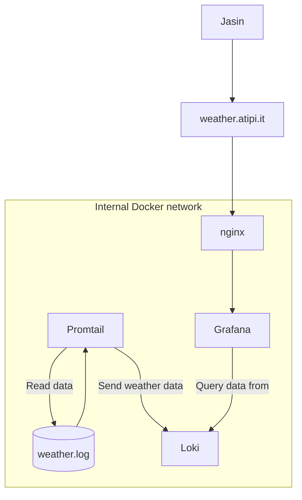

+++
title = 'Raspberry Pi, Grafana, Loki, Promtail and Weather'
date = '2025-02-10T17:00:00+01:00'
author = 'Jasin Atipi'
+++
# What
High humidity is not my friend. I live near a lake and it gets humid especially during winter.

I'm writing this post as a note to my future self in case I need to re-create everything.

I have bought a [DHT22](https://www.adafruit.com/product/385) sensor that measures Temperature + Humidity.

My goal was to have an online dashboard where I can access data about my room's temp+humidity.

Why not buy a regular sensor with temp+humidty with an lcd display..?

Well, I wanted to try experimenting with this kind of stuff outside my work life and get my hands dirty.

# How
These are the things I put together (mixed levels of abstraction):
- Raspberry pi
- DHT22
- cronjob that runs a python program to fetch the data and save it to a file
- grafana+loki+promtail to fetch/query/visualise the data
- nginx to expose the dashboard to the internet
- docker-compose for everything :) 

I realise there's loads of pre-ready solutions out there but I wanted to bootstrap this from scratch myself.

### Cronjob
Every minute:
```
* * * * * <whatever>/venv/bin/python <whatever>/poll.py
```
### Python script
Python dependency needed as of Feb 2025:
`adafruit-circuitpython-dht`
```python
import time
import board
import adafruit_dht
import logging

def logTemperature():
  temperature = dhtDevice.temperature
  humidity = dhtDevice.humidity
  logging.info('Temp={0:0.1f} C and Humidity={1:0.1f} %'.format(temperature, humidity)) # "Temp=20.0 C and Humidity=55 %"

dhtDevice = adafruit_dht.DHT22(board.D4) # depends on which pin it is attached to
logging.basicConfig(filename='<whatever>/weather.log', filemode='a', format='%(created)f %(message)s', level=logging.INFO) # timestamp then temp+humidity

logTemperature()

dhtDevice.exit()
```

### Promtail
This time I haven't bothered (I will regret this) to create a docker-compose file for everything, I just ran promtail with this one-liner:

```bash
docker run -d --name=promtail -v <whatever>/promtail-config.yml:/etc/promtail/config.yml -v <whatever>/weather.log:/var/log/sensor_data.txt grafana/promtail
```
This will read the `weather.log` file which contains the juicy 🧡 data.

C'mon, you know how Docker volumes work, no need to explain that here.

### Loki 😈
Same goes for loki... (I will regret this as well)
```bash
docker run -d --name=loki -p 3100:3100 grafana/loki
```

### Grafana 🐅
Ok, I actually created a docker-compose file for this one:
```yaml
version: '3.8'

services:
  grafana:
    image: grafana/grafana
    container_name: grafana
    restart: unless-stopped
    ports:
      - "3000:3000"
    volumes:
      - ./grafana.ini:/etc/grafana/grafana.ini
      - ./data:/var/lib/grafana
```
Which is kinda useless tbh, I should've just put promtail+loki here anyway but I'm too lazy now.

### nginx 🚒
I also launched nginx as a docker container.
Grafana and nginx need to be part of the same network in order for nginx to have visibility of grafana. (same goes for the promtail+grafana+loki btw)
Now I have to expose everything to the internet.

First I needed to generate a certificate for wherever I wanted to expose grafana to.
`weather.atipi.it` (using certbot)

Here's the relevant nginx config:
```nginx configuration
...
http {
...
    server {
    ...
        listen 80;
        server_name weather.atipi.it;
        location / {
            return 301 https://$host$request_uri;
        }
    ...
    }
    ...
    server {
        listen 443 ssl;
        server_name weather.atipi.it;

        ssl_certificate /<cert-path>/weather.atipi.it/fullchain.pem; # <- certs, can be mounted using volumes
        ssl_certificate_key /<cert-path>/letsencrypt/live/weather.atipi.it/privkey.pem;
        location / {
            proxy_pass http://grafana:3000/; # <- this is the grafana instance running on docker
            ...
        }
    }
}
```

### Summary
Here's a quick drawing:

And here's a quick screenshot of what I see
